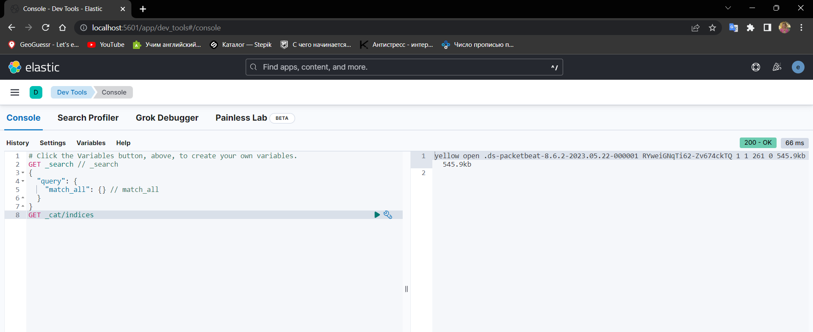

# Развертывание системы мониторинга ELK Stack (Elasticsearch)
Сафрыгина А.Н.

## Цель работы

1\. Освоить базовые подходы централизованного сбора и накопления
информации

2\. Освоить современные инструменты развертывания контейнирозованных
приложений

3\. Закрепить знания о современных сетевых протоколах прикладного уровня

## Ход выполнения практической работы

### Задание 1. Развернуть систему мониторинга на базе ElasticSearch

1\. Настройка

    Для работы ElasticSearch требуется увеличить размер виртуальной памяти системы:

``` text
sudo sysctl -w vm.max_map_count=262144
```

2\. Создание docker-compose.yml

Формируем файлы с конфигурациями (docker-compose.yml, .env), следуя
инструкции по ссылке:
https://www.elastic.co/guide/en/elasticsearch/reference/current/docker.html

3\. Создание filebeat.yml и packetbeat.yml

3.1. Скачиваем и редактируем файлы

4\. Разворачиваем сервис с помощью команды:

    docker-compose up


4\. Переходим на `localhost:5061` и авторизируемся


5\. Проверям, что установленны все средства для сбора информации из
файлов журналов и сбора аналитики трафика



6\. Создаем новый data view для packetbeat


## Оценка результата

Была развёрнута система ElasticSearch и настроена система сбора трафика
и лог-файлов.

## Вывод

В результате работы была освоена система контейнеризации приложений
Docker, работа с Docker-compose и освоена система централизованного
сбора и накопления информации ElasticSearch.
