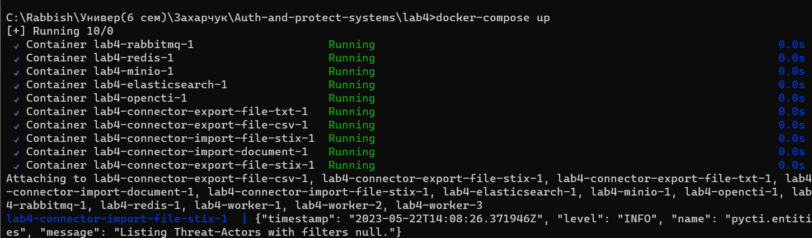
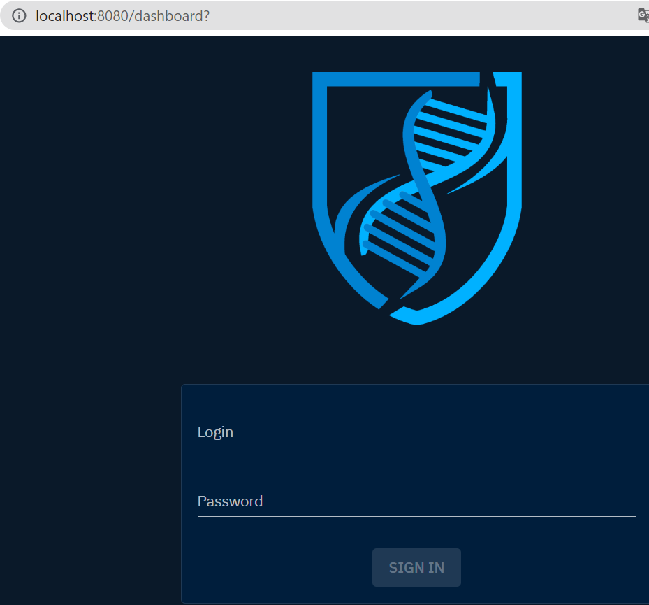
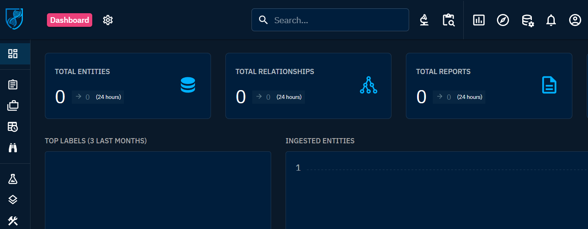

# Развертывание Threat intelligence Platform OpenCTI
Сафрыгина Анастасия

## Цель работы

1.  Освоить базовые подходы процессов Threat Intelligence

2.  Освоить современные инструменты развертывания контейнеризованных
    приложений

3.  Получить навыки поиска информации об угрозах ИБ

## Ход выполнения практической работы

Для разворачивания системы threat intelligence OpenCTI была использована
система контейнеризации приложений Docker.

### Шаг 1 - Предварительная конфигурация

#### 1.Для работы ElasticSearch требуется увеличить размер виртуальной памяти системы:

``` text
sudo sysctl -w vm.max_map_count=262144
```

### Шаг 2 - Создание docker-compose.yml и .env

Был скачан и отредактирован файл по ссылке:
https://github.com/OpenCTI-Platform/docker

### Шаг 3 - Разворачиваем сервис с помощью команды:

``` text
docker-compose up 
```



#### Шаг 4 - Использование системы threat intelligence OpenCTI

1.После перехода на веб-ресурс OpenCTI пользователя встречает поле
авторизации:



2.Входим по указанным в конфигурации окружения логину и паролю.

3.После входа появляется веб-интерфейс:



## Оценка результата

Таким образом, были изучены возможности работы с платформой threat
intelligence OpenCTI.

## Выводы

Таким образом, были изучены возможности работы с платформой threat
intelligence OpenCTI.
